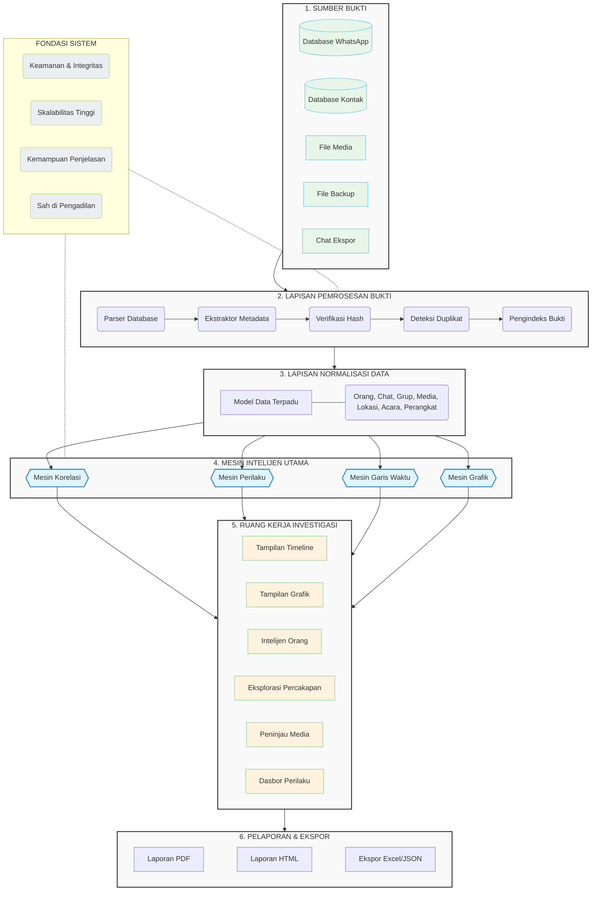

# Platform Intelijen Investigasi WhatsApp (WIIP)

## Ringkasan Eksekutif (Executive Summary)
Alat forensik digital tradisional sangat efektif dalam mengekstraksi bukti dari perangkat seluler. Namun, para penyidik masih menghabiskan banyak waktu secara manual untuk mengkorelasikan percakapan, merekonstruksi garis waktu (timeline), mengidentifikasi hubungan, dan memahami konteks di balik sebuah insiden.

### Visi
Menjadi platform intelijen investigasi terkemuka di dunia yang mampu mengubah bukti digital menjadi wawasan investigasi yang dapat ditindaklanjuti.

### Misi
* Mengurangi waktu investigasi.
* Menghilangkan proses korelasi bukti secara manual.
* Merekonstruksi riwayat komunikasi digital.
* Mengungkap hubungan tersembunyi.
* Mendeteksi perubahan perilaku komunikasi.
* Mendukung investigasi yang didorong oleh bukti.
* Mempertahankan analisis yang dapat dijelaskan dan dipertanggungjawabkan di pengadilan.

### Filosofi Produk
Perangkat lunak forensik tradisional menjawab:
*"Bukti apa yang ada?"*

WIIP menjawab:
**"Bagaimana semua kepingan bukti tersebut saling terhubung?"**

---

## Arsitektur Inti (Core Architecture)

---

## Fondasi Sistem (System Foundation)
WIIP dibangun di atas empat mesin intelijen inti. Setiap fitur di dalam platform ini dihasilkan dari mesin-mesin tersebut, memungkinkan sistem untuk tetap terukur (scalable), dapat dijelaskan (explainable), dan dapat diperluas (extensible).

### 1. Mesin Korelasi (Correlation Engine)
**Tujuan:**
Menghubungkan setiap artefak digital melintasi database WhatsApp yang tidak terbatas.

**Objek yang Didukung:**
* Orang (Person) | Nomor Telepon | Perangkat
* Obrolan (Chat) | Grup | Media
* Catatan Suara | Panggilan | Lokasi
* Dokumen | Tautan | Stempel Waktu

**Kemampuan:**
* Korelasi Multi-Database
* Pencari Kontak/Grup/Media/Catatan Suara/Dokumen/Lokasi/Tautan Bersama
* Deteksi Bukti Duplikat
* Korelasi Garis Waktu & Perbandingan Pesan
* Deteksi Bukti dan Pesan yang Hilang
* Rantai Terusan (Forward), Balasan (Reply), Kutipan (Quote)
* Perbandingan Lintas Database

### 2. Mesin Perilaku (Behavior Engine)
**Tujuan:**
Menganalisis perilaku komunikasi digital, alih-alih hanya berfokus pada isi pesan. Perilaku itu sendiri menjadi sebuah bukti digital.

**Analisis Pola Komunikasi:**
* Pola Aktivitas (Harian/Mingguan/Bulanan)
* Distribusi Jam Aktif & Jam Komunikasi Puncak
* Frekuensi Komunikasi & Durasi Percakapan
* Pola Waktu Respon
* Frekuensi Berbagi Media & Panggilan

**Deteksi Perubahan Perilaku:**
* Deteksi Lonjakan Komunikasi (Burst) & Periode Diam (Silent Period)
* Kemunculan/Menghilangnya/Pergantian Kontak
* Peningkatan/Penurunan Aktivitas Tiba-tiba
* Pola Bergabung/Keluar dari Grup
* Pola Penghapusan & Penerusan Pesan
* Pola Berbagi Lokasi

**Indikator Perilaku:**
* Skor Aktivitas, Skor Interaksi, Skor Konsistensi, Stabilitas Komunikasi, Kekuatan Hubungan.

### 3. Mesin Garis Waktu (Timeline Engine)
**Tujuan:**
Mengonversi bukti-bukti yang terisolasi menjadi satu garis waktu investigasi yang kronologis dan berkesinambungan.

**Objek Garis Waktu:**
* Pesan, Panggilan, Gambar, Video, Catatan Suara, Dokumen, Lokasi, Pesan Dihapus, Pesan Diteruskan, Balasan, Kutipan.

**Kemampuan:**
* Garis Waktu Terpadu (Unified Timeline)
* Cuplikan Historis (Historical Snapshot) & Putar Ulang Garis Waktu
* Perbandingan Garis Waktu
* Korelasi Peristiwa & Rantai Cerita (Story Chain)
* Putar Ulang Investigasi (Investigation Replay)

### 4. Mesin Grafik (Graph Engine)
**Tujuan:**
Merepresentasikan setiap objek bukti sebagai sebuah grafik investigasi yang saling terhubung.

**Kemampuan:**
* Grafik Hubungan & Pemetaan Keluarga
* Deteksi Komunitas & Deteksi Lingkaran Tersembunyi (Hidden Circle)
* Irisan Kontak & Grup
* Evolusi Hubungan
* Deteksi Orang Penghubung (Bridge Person)
* Matriks Komunikasi

---

## Modul Produk (Product Modules)

### Manajemen Kasus (Case Management)
Mengelola siklus hidup investigasi.
**Fitur:** Dasbor Kasus, Manajer Bukti, Penugasan Penyidik, Chain of Custody, Jejak Audit, Verifikasi (Hash) Bukti, Catatan, Bookmark, Tagging.

### Pemrosesan Bukti (Evidence Processing)
Mengimpor dan memvalidasi bukti digital (DB WhatsApp, Kontak, Media, Backup, Chat Ekspor).
**Fitur:** Parsing Database, Ekstraksi Metadata, Pengindeksan, Deteksi Duplikat, Verifikasi Hash.

### Intelijen Orang (People Intelligence)
Membangun profil lengkap untuk setiap nomor telepon (Alias, Jam Aktif, Kontak/Grup Favorit, Bukti/Lokasi Bersama).

### Intelijen Percakapan (Conversation Intelligence)
Menganalisis konten komunikasi (Eksplorer Obrolan, Statistik, Peta Panas Komunikasi).

### Intelijen Media (Media Intelligence)
Menganalisis bukti multimedia (Peramban Media, Deteksi Duplikat Media/Dokumen, OCR, Metadata).

### Intelijen Lokasi (Location Intelligence)
Memvisualisasikan bukti lokasi (Peta, Garis Waktu Lokasi, Titik Pertemuan, Riwayat Rute, Korelasi Geografis).

### Ruang Kerja Investigasi (Investigation Workspace)
Ruang kerja terpadu di mana penyidik dapat menyematkan (pin) berbagai objek (Kontak, Pesan, Media, Lokasi). Semuanya tetap tersinkronisasi dengan Mesin Garis Waktu, Grafik, dan Perilaku.

### Pelaporan (Reporting)
Menghasilkan laporan yang siap untuk pengadilan (PDF, HTML, Excel, JSON).

---

## Fitur Unggulan (Killer Features)

1. **Papan Korelasi Langsung (Live Correlation Board):** Setiap interaksi akan langsung memperbarui Garis Waktu, Grafik Hubungan, dan Dasbor Perilaku tanpa perlu analisis ulang manual.
2. **Intelijen Perilaku (Behavior Intelligence):** Mengidentifikasi lonjakan komunikasi, periode diam, kontak baru, hingga tren penghapusan pesan.
3. **Rantai Cerita (Story Chain):** Melihat urutan komunikasi secara utuh (Pesan -> Balasan -> Panggilan -> Media Bersama -> Lokasi -> Pesan Dihapus -> Komunikasi Berhenti).
4. **Cuplikan Historis (Historical Snapshot):** Merekonstruksi investigasi persis seperti yang terlihat pada tanggal tertentu.
5. **Putar Ulang Kasus (Case Replay):** Memutar ulang jalannya investigasi secara kronologis.
6. **Evolusi Hubungan (Relationship Evolution):** Memvisualisasikan jaringan komunikasi (Sebelum, Selama, dan Setelah Insiden).
7. **Deteksi Lingkaran Tersembunyi (Hidden Circle Detection):** Mendeteksi komunitas komunikasi tersembunyi.
8. **Pencari Bukti Umum (Common Evidence Finder):** Mendeteksi bukti identik melintasi database yang tidak terbatas.
9. **Garis Waktu Multi-Database:** Menggabungkan banyak database WhatsApp ke dalam satu garis waktu tersinkronisasi.
10. **Penganalisis Celah Investigasi (Investigation Gap Analyzer):** Mengungkapkan "bukti yang hilang" (misal: Perangkat saksi yang hilang, Celah komunikasi).
11. **Korelasi Lintas Kasus (Cross-Case Correlation):** Mengkorelasikan nomor telepon, alias, atau hash media melintasi kasus-kasus sebelumnya.
12. **Mesin Keyakinan Bukti (Evidence Confidence Engine):** Memastikan setiap temuan tetap transparan dan dapat diverifikasi secara independen dengan menyertakan jumlah referensi dan kekuatan korelasi.

---

## Alur Kerja Produk (Product Workflow)
1. Pengumpulan Bukti
2. Validasi Bukti
3. Pemrosesan Data
4. Analisis Korelasi
5. Analisis Perilaku
6. Rekonstruksi Garis Waktu
7. Pemetaan Hubungan
8. Ruang Kerja Investigasi
9. Tinjauan Bukti
10. Laporan Siap Pengadilan (Court-Ready Report)

---

## Pemosisian Produk & Tagline (Product Positioning)
Ini adalah Platform Intelijen Investigasi yang mengubah bukti digital yang terfragmentasi menjadi ekosistem investigasi yang saling terhubung. Setiap pesan, orang, media, lokasi, stempel waktu, dan perangkat menjadi bagian dari satu grafik investigasi, memungkinkan penyidik untuk tidak hanya memahami *apa* yang terjadi, tetapi juga *bagaimana* setiap bagian dari bukti tersebut saling terhubung.

**Tagline:**
*Melampaui Forensik WhatsApp. Dibangun untuk Intelijen Investigasi.* (Beyond WhatsApp Forensics. Built for Investigation Intelligence.)
