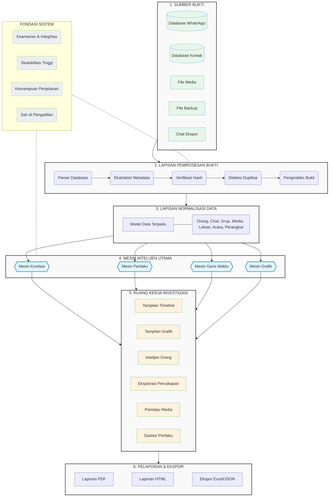

# WIIP (WhatsApp Investigation Intelligence Platform)
**Dokumen Master Arsitektur & Daftar Tugas (Task List)**

Dokumen ini berfungsi sebagai panduan utama bagi tim Backend Developer untuk memahami konsep, alur, dan urutan pengerjaan proyek WIIP secara menyeluruh.

---

## 1. Executive Summary
Alat forensik digital tradisional sangat efektif untuk mengekstrak bukti dari perangkat seluler. Namun, para penyidik masih menghabiskan banyak waktu untuk secara manual menghubungkan percakapan, merekonstruksi garis waktu (timeline), mengidentifikasi hubungan, dan memahami konteks di balik sebuah insiden.

### Visi
Menjadi platform intelijen investigasi terdepan di dunia yang mampu mengubah bukti digital menjadi wawasan investigasi yang dapat ditindaklanjuti (actionable insights).

### Misi
* Mengurangi waktu investigasi.
* Menghilangkan proses korelasi bukti secara manual.
* Merekonstruksi sejarah komunikasi digital.
* Mengungkap hubungan tersembunyi (hidden relationships).
* Mendeteksi perubahan perilaku komunikasi.
* Mendukung investigasi berbasis bukti (evidence-driven investigations).
* Mempertahankan analisis yang dapat dijelaskan dan dapat dipertanggungjawabkan di pengadilan (court-defensible).

### Filosofi Produk
Perangkat lunak forensik tradisional menjawab: *"Bukti apa yang ada?"*
WIIP menjawab: **"Bagaimana semua potongan bukti tersebut saling terhubung?"**

**Tagline:** *Beyond WhatsApp Forensics. Built for Investigation Intelligence.*

---

## 2. Arsitektur Inti (Core Architecture)

Sistem ini dibangun di atas fondasi keamanan yang menjamin integritas data (Chain of Custody), skalabilitas tinggi, dapat dijelaskan (Explainability), dan sah di mata hukum (Court Defensible). Arsitektur WIIP dibagi menjadi 6 lapisan utama:

### Penjelasan 4 Mesin Intelijen Utama (Layer 4)
1. **Mesin Korelasi (Correlation Engine):** Menghubungkan setiap artefak digital melintasi database WhatsApp yang tidak terbatas (misal: mencari kontak, grup, media, atau lokasi yang sama antar tersangka).
2. **Mesin Perilaku (Behavior Engine):** Menganalisis perilaku komunikasi (bukan hanya isi pesan). Mendeteksi pola jam aktif, lonjakan aktivitas (*burst*), kontak yang tiba-tiba hilang/muncul, atau perubahan ritme komunikasi.
3. **Mesin Garis Waktu (Timeline Engine):** Mengubah bukti-bukti yang terisolasi menjadi satu garis waktu (timeline) investigasi yang kronologis dan berkesinambungan.
4. **Mesin Grafik (Graph Engine):** Merepresentasikan setiap objek bukti sebagai grafik investigasi yang saling terhubung (Pemetaan keluarga, deteksi komunitas, deteksi lingkaran tersembunyi).

---

## 3. Fitur-Fitur Unggulan (Killer Features)
* **Live Correlation Board:** Setiap interaksi pada workspace akan langsung memperbarui Timeline, Graph, List, dan Statistik tanpa perlu analisis ulang secara manual.
* **Story Chain:** Investigator tidak melihat pesan secara terisolasi, melainkan melihat rangkaian cerita utuh (Pesan -> Balasan -> Panggilan -> Berbagi Lokasi -> Pesan Dihapus).
* **Case Replay:** Memutar ulang investigasi secara kronologis dari waktu ke waktu.
* **Relationship Evolution:** Memvisualisasikan bagaimana jaringan komunikasi berubah (Sebelum, Saat, dan Sesudah insiden).
* **Hidden Circle Detection:** Mendeteksi komunitas tersembunyi berdasarkan analisis kontak bersama, grup bersama, dan frekuensi interaksi.
* **Multi-Database Timeline:** Menggabungkan tak terbatas database WhatsApp ke dalam satu timeline investigasi tersinkronisasi.
* **Investigation Gap Analyzer:** Menampilkan bukti yang "Hilang" (misalnya: perangkat saksi yang tidak ada, periode tanpa komunikasi/blackout).
* **Cross-Case Correlation:** Mengaitkan nomor telepon, alias, hash media, lokasi, atau grup yang berulang melintasi kasus-kasus sebelumnya.

---

## 4. Daftar Tugas Implementasi (Task Roadmap)

Berikut adalah panduan urutan pengerjaan (Task List) bagi tim Backend, yang disusun dari level paling dasar (Data) hingga teratas (Workspace).

### PHASE 1: SYSTEM FOUNDATION & EVIDENCE PROCESSING LAYER
* [x] **Task 1.1: Setup Evidence Sources & Storage**
  * Konfigurasi penyimpanan raw evidence (`data/raw_evidence`).
  * Setup Chain of Custody & mekanisme Audit Trail.
* [x] **Task 1.2: Implementasi Metadata Extractor & Hash Verification**
  * Buat script untuk verifikasi Hash (SHA256/MD5) pada setiap file.
  * Ekstraksi metadata file media (EXIF, ukuran, timestamp).
* [ ] **Task 1.3: Setup API Dasar (Case Management & Evidence Upload)**
  * Buat API Endpoint untuk Create/List Cases.
  * Buat API Endpoint untuk Evidence Ingestion & integrasikan ke service (Task 1.1).
* [ ] **Task 1.4: Integrasi WhatsApp Extractor ke Worker**
  * Pindahkan proses dekripsi (crypt15) dan parsing SQLite ke Celery tasks.
  * Implementasi Duplicate Evidence Detection saat proses impor.
* [ ] **Task 1.5: Evidence Indexer**
  * Setup indexing engine (misal: Elasticsearch / Postgres TSV) untuk pencarian cepat.

### PHASE 2: DATA NORMALIZATION LAYER
* [ ] **Task 2.1: Desain Skema Database Terpadu (Unified Data Model)**
  * Buat tabel/skema untuk: People, Chats, Groups, Media, Locations, Events, Devices.
* [ ] **Task 2.2: Implementasi Data Mapper / Standardizer**
  * Buat skrip untuk memetakan data raw WhatsApp menjadi format standar (Unified Data Model).
  * Penanganan timestamp consistency (konversi UTC / zona waktu).

### PHASE 3: CORE INTELLIGENCE ENGINES
* [ ] **Task 3.1: Correlation Engine**
  * Multi-Database Correlation (Penyatuan data dari >1 DB).
  * Shared Finder (Contact, Group, Media, Location, Link).
  * Common Evidence Finder & Message Comparison.
* [ ] **Task 3.2: Behavior Engine**
  * Communication Pattern Analysis (Daily/Weekly pattern, Peak hours).
  * Behavior Change Detection (Burst detection, Silent period, Sudden drops).
  * Behavior Scoring (Activity Score, Interaction Score).
* [ ] **Task 3.3: Timeline Engine**
  * Unified Timeline Builder (mengurutkan Messages, Calls, Media, dll secara kronologis).
  * Historical Snapshot & Timeline Comparison.
  * Story Chain generation (merangkai pesan terkait, reply, quote).
* [ ] **Task 3.4: Graph Engine**
  * Relationship Graph Builder (Nodes & Edges).
  * Community Detection & Hidden Circle Detection.
  * Bridge Person Detection & Communication Matrix.

### PHASE 4: PRODUCT MODULES (API & LOGIC)
* [ ] **Task 4.1: Case Management Module**
  * API untuk Case Dashboard, Investigator Assignment, Case Status.
* [ ] **Task 4.2: People Intelligence Module**
  * API untuk Contact Profile, Aliases, Favorite Contacts/Groups.
* [ ] **Task 4.3: Conversation Intelligence Module**
  * API untuk Chat Explorer, Keyword Search, Conversation Statistics.
* [ ] **Task 4.4: Media & Location Intelligence Module**
  * API untuk Media Browser, Shared Media, OCR integration.
  * API untuk Map View, Meeting Point Detection, Route History.

### PHASE 5: INVESTIGATION WORKSPACE & REPORTING
* [ ] **Task 5.1: Live Correlation Board**
  * Sinkronisasi event-driven (Websockets/SSE) agar Workspace update otomatis tanpa manual re-analysis.
* [ ] **Task 5.2: Investigation Gap Analyzer & Cross-Case Correlation**
  * Deteksi missing witness device / timeline gaps.
  * Deteksi entitas berulang (Recurring phone numbers, hashes) di kasus-kasus sebelumnya.
* [ ] **Task 5.3: Case Replay Feature**
  * Sistem playback investigasi secara berurutan berdasarkan kronologi.
* [ ] **Task 5.4: Court-Ready Reporting Engine**
  * Implementasi export laporan (Executive Summary, Timeline, Graph) ke PDF, HTML, Excel, JSON.
  * Sertakan Evidence Confidence Engine (Strength, Database Reference) dalam laporan.
